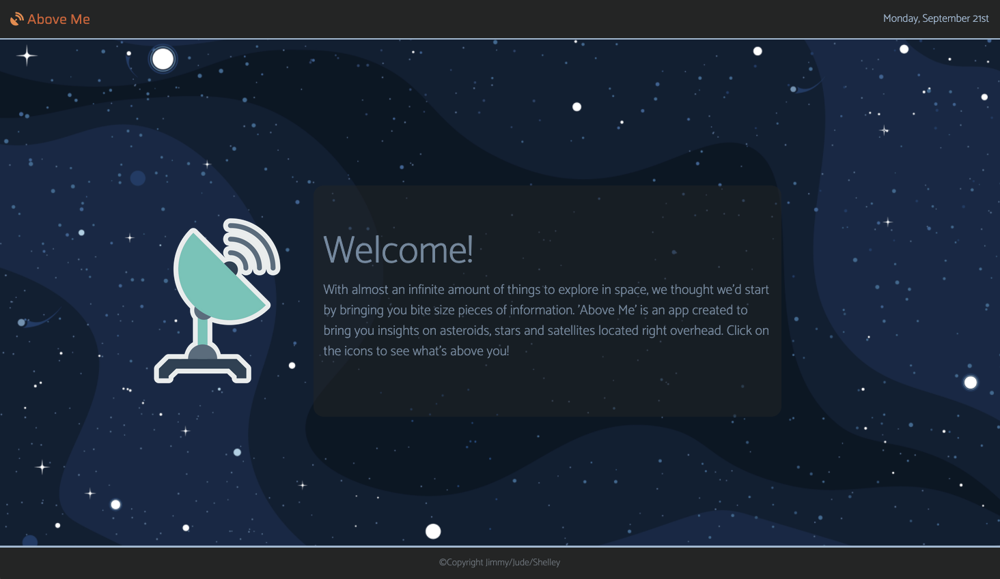
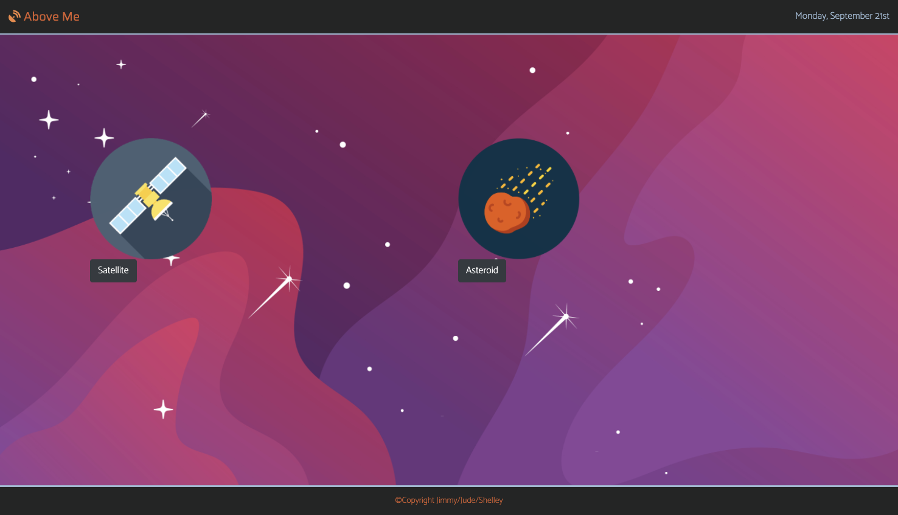
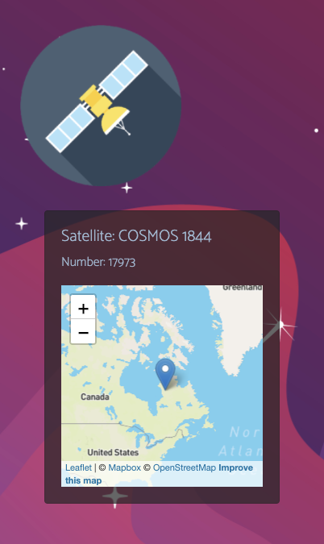
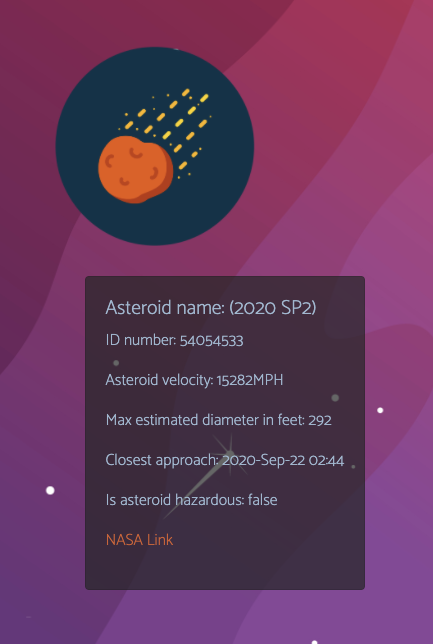
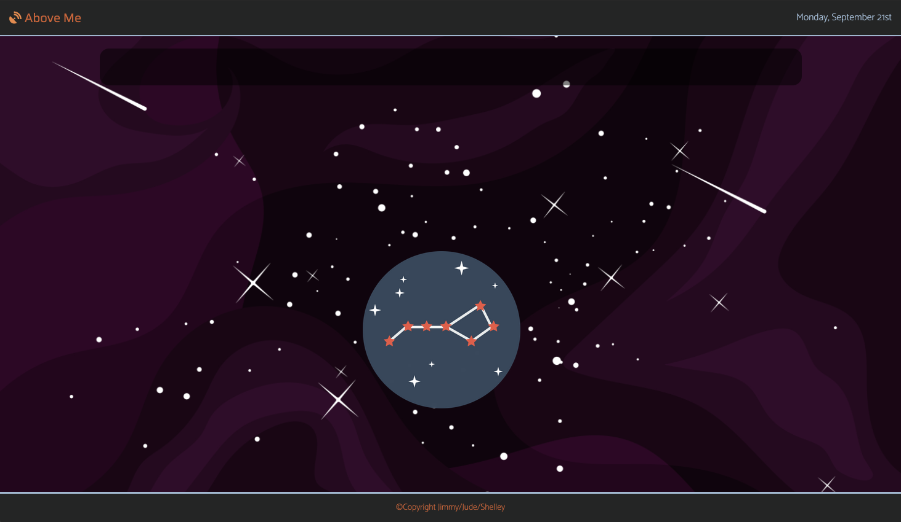
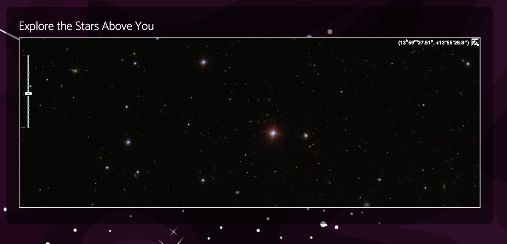
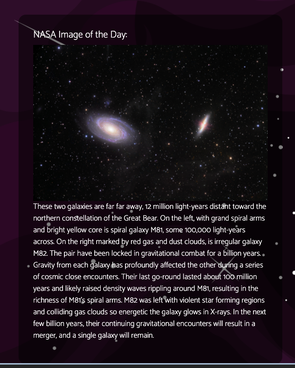
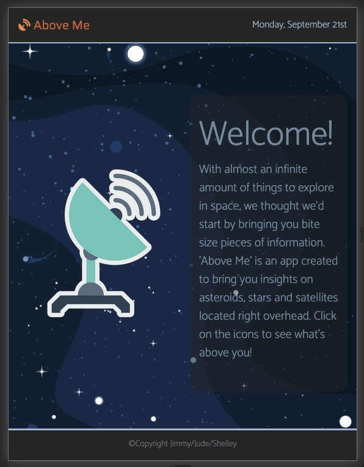
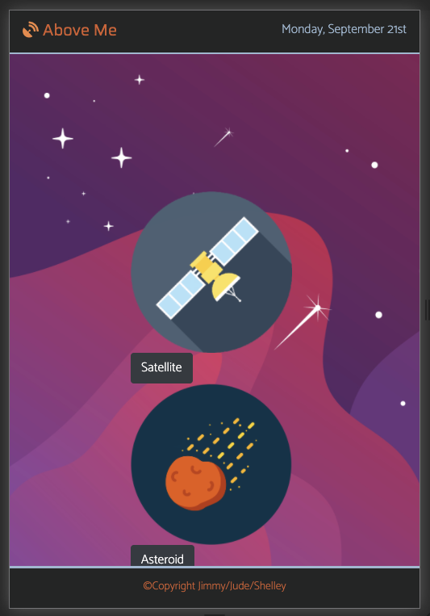
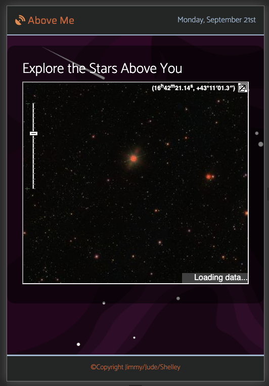

# Above_Me-Astronomy_Localized

ABOVE ME is a sleek educational tool that provides up-to-date details on a variety of satellites, asteroids and stars that are directly above the user.

[Above Me Deployed Site](https://raleighc.github.io/above_me-astronomy_localized/)

## Concept

An overwhelming amount of information exists on-line regarding the universe outside of our planet. This app aims to deliver a daily, digestible amount of information to the user based on their location and what can be found above them. Based on the times of sunrise and sunset at the users location, the experience and  information that is accessible to the user changes. 

Upon sunrise, the user will find information on a satellite and asteroid that are currently near or in orbit  of the earth. After sunset, the user will be able to explore the sky above them by accessing an interactive map of the stars above and a photograph with corresponding information from NASA’s database below. Inspired by the “word of the day” concept, the goal of the ABOVE ME app is to provide updated information on a daily basis.

## Motivation

With today's technology gripping user's attention for hours on end, we thought to create a tool that feeds people's curiosity for just a brief moment a the day. Instead of overwhelming the user with information or them having to take an astronomy class, why not learn a tiny bit each day?

## Usage

Upon visiting the page, the user will be prompted to share their location with the app. After sharing, the page welcomes the user and shares the concept of the page with them. The users location if then used to dynamically populate the icon in the center of the page to one of two pages that are available. The sunrise page is linked between the hours of sunrise and sunset specific to the users location. The sunset page is linked after sunset until sunrise the following day.
The user will then click the icon to begin their experience.

The sunrise page presents the user with one satellite and one asteroid selection populated from information using the users longitude and latitude.

When the satellite icon is click, the information is delivered in an expandable card containing relevant information and a map of the satellites location.

When the asteroid icon is clicked, the information in the card is populated about the asteroid and a link taking the user to a graph of the asteroids trajectory.

The sunset page presents the user with a single icon that, when clicked, populates the page with two windows. 

The first window is a Sky-Map that is updated to the users current view of the stars based on their right ascension and declination. This window is interactive and can be zoomed in and out and explored to get info about individual stars when moused over.

The second window contains the NASA image of the day and accompanying description.

The site is designed to be responsive to different devices and mobile ready as demonstrated in the following screenshots.

## Creating This Page

This application was created as a team by researching and implementing API calls to generate a user experience of concentrated and concise information. We divided up the API retrieval and research and then Cody took the lead on the Sunrise page and Raleigh took the lead of the Sunset page.
Our main struggles came from API limitations. We went down a few unnecessary rabbit holes and some necessary ones to finally land on the final product we have now. The struggle came from being able to successful publish the information we found in the APIs onto the page. Be it text format issues, pull limits, or lack of documentation, we finished with a product we are very proud of but feels like a strong foundation to build on. We plan to further develop this idea and find ways to bring the information to the page to create a user experience that we can take part in ourselves.

## Future Development
- Researching different API retrieval process to gain further understanding
- Improve button functionality
- Enhance live tracking/mapping

## Authors and Acknowledgment

This application was created, designed, and executed by Cody Bonsma, Raleigh Chesney, and Shelley Collins.

APIs:
* [Sunrise Sunset](https://sunrise-sunset.org/api)
* [UPHERE.SPACE](https://uphere.space/)
* [Astroid NeoWs](https://cneos.jpl.nasa.gov/)
* [NASA's Astronomy Picture of the Day](https://apod.nasa.gov/apod/astropix.html)
* [SKY-MAP](http://wikisky.org/api?locale=EN)
* [Mapbox/Leaflet](https://docs.mapbox.com/mapbox.js/api/v3.3.1/)

Web Dev Tools:
* [Bootstrap](https://getbootstrap.com/)
* [Stack Overflow](https://stackoverflow.com/)
* [w3schools!](https://www.w3schools.com/bootstrap4/default.asp)
* [Moment.js](https://momentjs.com/)

Special thanks to Jonathan Watson for getting us here, and Philip Simmons and Peter Colella for their help and support through the project.

## Languages used
HTML5, CSS3, JavaScript, jQuery

## Contributions

When contributing to this repository, please contact the owner of the repository before pushing any updates.
When contributions are accepted, please update the readme.md noting any changes that have been made.

## License

MIT License

Copyright (c) 2020 Raleigh Chesney

Permission is hereby granted, free of charge, to any person obtaining a copy
of this software and associated documentation files (the "Software"), to deal
in the Software without restriction, including without limitation the rights
to use, copy, modify, merge, publish, distribute, sublicense, and/or sell
copies of the Software, and to permit persons to whom the Software is
furnished to do so, subject to the following conditions:

The above copyright notice and this permission notice shall be included in all
copies or substantial portions of the Software.

THE SOFTWARE IS PROVIDED "AS IS", WITHOUT WARRANTY OF ANY KIND, EXPRESS OR
IMPLIED, INCLUDING BUT NOT LIMITED TO THE WARRANTIES OF MERCHANTABILITY,
FITNESS FOR A PARTICULAR PURPOSE AND NONINFRINGEMENT. IN NO EVENT SHALL THE
AUTHORS OR COPYRIGHT HOLDERS BE LIABLE FOR ANY CLAIM, DAMAGES OR OTHER
LIABILITY, WHETHER IN AN ACTION OF CONTRACT, TORT OR OTHERWISE, ARISING FROM,
OUT OF OR IN CONNECTION WITH THE SOFTWARE OR THE USE OR OTHER DEALINGS IN THE
SOFTWARE.

